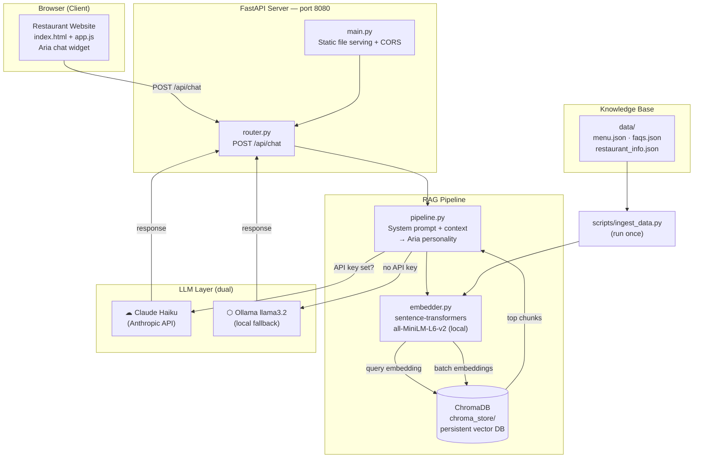

# Casa Alo's Bistro — Aria AI Chatbot

[](https://alorestaurant-production.up.railway.app)
[](https://github.com/akabonge/alorestaurant)
[](https://fastapi.tiangolo.com)
[](https://anthropic.com)
[](https://trychroma.com)
[](https://ollama.ai)
[](https://aialo.io)

**Demo 1 of the AI Alo Portfolio** · [aialo.io](https://aialo.io)

A RAG-powered restaurant chatbot built with FastAPI, ChromaDB, and sentence-transformers.
Supports Ollama (local, free) and Claude API (cloud, best quality) via a single `.env` flag.

**The pain point it solves:** Restaurant staff spend hours answering the same questions every day — menu questions, hours, allergens, reservations. Aria handles all of it 24/7.

---

## System Architecture



---

## Part of the AI Alo Portfolio

| Demo | Business | Key Feature |
|---|---|---|
| **Demo 1** | **Casa Alo's Bistro** | **Restaurant RAG chatbot** |
| Demo 2 | Rappahannock Realty Group | Lead qualifier + CRM dashboard |
| Demo 3 | Luminara Med Spa | Treatment recommender + candidacy screening |

Built by [Aloysious Kabonge](https://aialo.io) — AI automation consulting for local businesses in Fredericksburg, VA.

---

## Stack

| Layer | Tech |
|-------|------|
| Backend | FastAPI + Uvicorn |
| Vector DB | ChromaDB (local, persistent) |
| Embeddings | sentence-transformers `all-MiniLM-L6-v2` |
| LLM (cloud) | Anthropic Claude (haiku) |
| LLM (local) | Ollama (`llama3.2`) |
| Frontend | Vanilla HTML/CSS/JS (embeddable widget) |

## Quick Start

### 1. Install dependencies
```bash
cd casa_alos_bistro
pip install -r requirements.txt
```

### 2. Configure environment
```bash
cp .env.example .env
# Edit .env — add ANTHROPIC_API_KEY if you have one, or leave blank to use Ollama
```

### 3. Ingest data into ChromaDB
```bash
python scripts/ingest_data.py
```
This runs once (or whenever you update the data files). Downloads the embedding model on first run (~90MB).

### 4. Start the server
```bash
uvicorn app.main:app --reload
```

Open [http://localhost:8000](http://localhost:8000) — you'll see the restaurant website with the chat widget.

## API Endpoints

| Method | Path | Description |
|--------|------|-------------|
| `POST` | `/api/chat` | Send a message, get a response |
| `GET`  | `/api/health` | Check status, provider, doc count |
| `DELETE` | `/api/session/{id}` | Clear a conversation session |

### Chat request
```json
POST /api/chat
{
  "message": "What are your most popular dishes?",
  "session_id": "user_abc"
}
```

### Chat response
```json
{
  "response": "Our guests always rave about the Cacio e Pepe...",
  "sources": ["menu/Paste (Pastas)", "faqs/Menu & Food"],
  "session_id": "user_abc",
  "provider": "claude"
}
```

## LLM Selection Logic

```
ANTHROPIC_API_KEY set?
  ✓ → Uses Claude (cloud, best quality)
  ✗ → Uses Ollama (local, free, requires Ollama running)
```

Embeddings always run locally via sentence-transformers — no API key needed regardless.

## Data Files

| File | Contents |
|------|----------|
| `data/menu.json` | Full menu — 7 categories, 40+ items, prices, dietary info |
| `data/faqs.json` | 30+ FAQ Q&A pairs across 6 categories |
| `data/restaurant_info.json` | Hours, address, contact, parking, policies |

To update content, edit the JSON files and re-run `python scripts/ingest_data.py`.

## Project Structure

```
casa_alos_bistro/
├── app/
│   ├── main.py          # FastAPI app + CORS + static file serving
│   ├── router.py        # Chat, health, session endpoints
│   ├── config.py        # Settings (pydantic-settings, .env)
│   ├── models.py        # Request/response schemas
│   └── rag/
│       ├── embedder.py  # ChromaDB collection setup
│       ├── retriever.py # Top-k semantic search
│       └── pipeline.py  # RAG: retrieve → generate (Ollama or Claude)
├── data/
│   ├── menu.json
│   ├── faqs.json
│   └── restaurant_info.json
├── frontend/
│   └── index.html       # Restaurant website + embedded chat widget
├── scripts/
│   └── ingest_data.py   # One-time data indexing script
├── requirements.txt
├── .env.example
└── .gitignore
```
